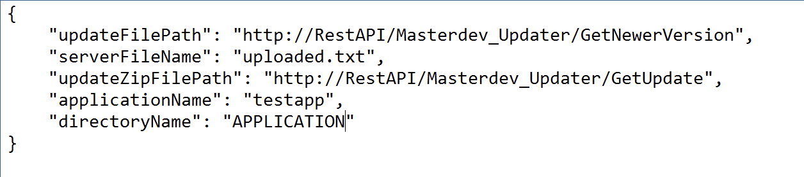
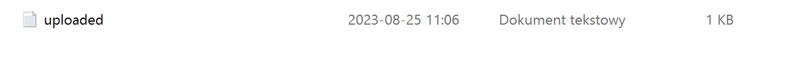

# Console app for updating applications 
 Console app for updating applications from zips on servers

## App explanation what it does
1. The job of this app is to ask api for newer version of app name we passed in confing. If db recorded newer version uploaded on RestAPI returns file name and version.
2. Than Console ask RestAPI for the file if availble return zip.
3. Now Console stops AppPool with name app passed in config
4. Creates backup zip of app
5. Unzips in directory name passed in config (Remember that zip directory scheme needs to be identical to be unziped in its destiny)
6. If error while uzpiping update unzips backup and returns error. If passed starts AppPool and app
7. Saves actual version in uploaded.txt in directory of app

## Config options

1. updateFilePath - "http://RestAPI/Masterdev_Updater/GetNewerVersion"
    change RestAPI with IP to your rest api
    
2. updateZipFilePath - "http://RestAPI/Masterdev_Updater/GetNewerVersion"
    change RestAPI with IP to your rest api
    
3. serverFileName - "uploaded.txt" 
    name of file in directory where is stored actual version and actual name of update file
    
4. applicationName - "testapp"
    Name must be the same for DB and for APPPool 
    
5. directoryName - "APPLICATION"
    Name of directory where app is stored
    
    

In uploaded (or named as u want) for first start ser version to 1.0.0
When u upload first update set more 1.0.1 or so ...
    
## Setting all files and console 

### Inside Application

## About

App is prepared to work in schedule once a day or so... configs are editable parts of app if your ip changes or name of app or name of function u dont need to change anything in code just config. U can handle many apps updates just change names console app dont contains id of app just name so it can be an issue. It can be easly changed in code.
